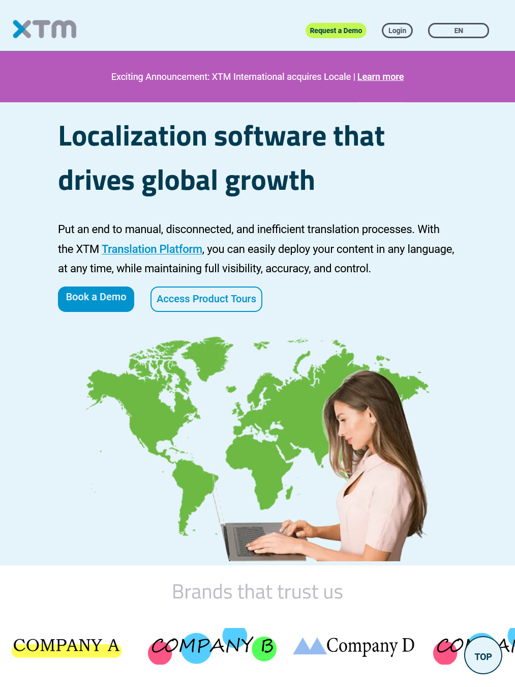
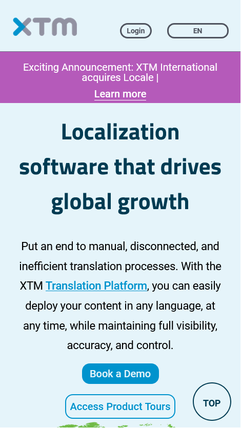

# Website Mock Up Project: XTM International

## **Coded by Haruka Arai**

## Objective

This is for school assignment to showcase what I learned and can handle semantic HTML and CSS.

## Copy right: XTM International

The original website is: https://xtm.cloud/

## What My Mock Up Site Has...

- [Landing page](https://harukaarai95.github.io/xtm-mock-up/)
- [About Us](https://harukaarai95.github.io/xtm-mock-up/pages/about.html)
- [Contact Us](https://harukaarai95.github.io/xtm-mock-up/pages/contact-us.html)
- [404 Page Not Found](https://harukaarai95.github.io/xtm-mock-up/pages/404.html)

## Responsible Layout

Landing page has a mega menu and "Request a Demo", "Log in" and "Language" buttons. Those layout changes depending on the device width. I set 1280px and 780px as breakpoint.  
Other components changes as well. Also, to be improve loading page speed, All icons and images are converted into SVGs or Webp files.

## Previews

# PC

# Tablet

# Mobile

